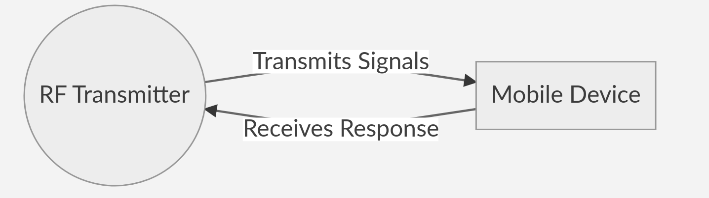

<!-- Copyright (c) 2018 Nikunj Gupta

Permission is hereby granted, free of charge, to any person obtaining
a copy of this software and associated documentation files (the "Software"),
to deal in the Software without restriction, including without limitation
the rights to use, copy, modify, merge, publish, distribute, sublicense,
and/or sell copies of the Software, and to permit persons to whom the Software
is furnished to do so, subject to the following conditions:

The above copyright notice and this permission notice shall be included in
all copies or substantial portions of the Software.

THE SOFTWARE IS PROVIDED "AS IS", WITHOUT WARRANTY OF ANY KIND,
EXPRESS OR IMPLIED, INCLUDING BUT NOT LIMITED TO THE WARRANTIES
OF MERCHANTABILITY, FITNESS FOR A PARTICULAR PURPOSE AND NONINFRINGEMENT.
IN NO EVENT SHALL THE AUTHORS OR COPYRIGHT HOLDERS BE LIABLE FOR ANY
CLAIM, DAMAGES OR OTHER LIABILITY, WHETHER IN AN ACTION OF CONTRACT,
TORT OR OTHERWISE, ARISING FROM, OUT OF OR IN CONNECTION WITH THE SOFTWARE
OR THE USE OR OTHER DEALINGS IN THE SOFTWARE. -->

# Rescue Net

## Abstract

Predicting natural disasters has always been a challenge for researchers around 
the world. The number of such occurrences are also increasing by the day. Until 
we find a way to make such deductions deterministic, we will require a robust 
way to help victims of these disasters.

In this project, we poropse a robust way to make communication with victims 
suffering in the disaster. We aid them by through communication with the 
concerned authorities responsible for the rescue operation. We present a drone 
based solution for communicating with the mobile devices.

## Introduction

Our project assumes a few constraints to start with. These are as follows:-

* [X] The mobile device (not limited to smartphones) should be switched on and 
in working conditions. (A better implementation is in works and can be looked into details in the future prospects section)

* [X] The mobile device should be in the range of the drone based communication 
device. (This has to be made sure by the authorities responsible for the rescue operation)

* [X] A person must hold on to the mobile device for communication purposes.

Now that we have defined the constraints and produced a general idea, we need 
to understand how we will integrate them together. We propose to build a drone 
which with a **long range** `RF signal` emitter. At the same time we utilize 
the mobile device as a `RF signal` receiver. A simple flow diagram is as 
follows:-

## Proposed Features

### Location Determination

Knowing the response from the mobile device, we can determine the location of 
the incoming signal. This will allow for accurate mapping of a person's 
location. This will help the concerned authorities to dispatch team in an 
efficient manner.

### Identification

Allowing the sginal to contain the details of the person will allow 
identification of people who're suffering in the disaster. This will help the 
government to correctly identify and act upon it to provide compensation for 
the loss of life. This will help the families to receive adequate compensation.

### Assessment

Since the signal receives a number of response, an approximately accurate 
assessment can be made. Such catastrophic disasters can then be assessed 
precisely.

### Safety deduction

After being rescued people can then emit signal signifying that they are safe. 
This will help in conveying the required details to the concerned family 
members.

## Proposed Implementation

The above description will be implemented through this project. A working code 
with a working video will be made available to prove our work.

koi problem ho to PR bnado
## Future Prospects

Considering that mobile device batteries are short lived, we had to reconsider 
the model on which we proposed the above project. We have found an adequate 
solution to the above problem as well. Since its implementation is dependent 
on various external factors, we will refrain from implementing anything in the 
current version of the project.

### Proposed solution to short-lived battery

Additional monitoring chip which responds only to the signal transmitted by 
the drone can be installed. This will ensure privacy as those drones are 
guaranteed that frequency of operation. At the same time, it is ensured that 
these chips will be long lived (anywhere from a few days to a month), thus 
enabling them to be useful in the above setting.

## Team Info

The team comprises of three 2nd year undergraduates currently pursuing 
Computer Science and Engineering (CSE) at IIT Roorkee. There names are as 
follows:

* Nikunj Gupta
* Kanav Gupta
* Rohit Ashiwal

The team focuses on innovative solution that can help masses in a catastrophic 
situation such as natural disaster.

### EULA

The complete idea and implementation is bound by a MIT Licence (details of the 
license can be seen [here](./LICENSE)) and the code provided is proprietary 
with copyrights available in every file. Due credits to the authors should be 
given when attempting to copy the code.